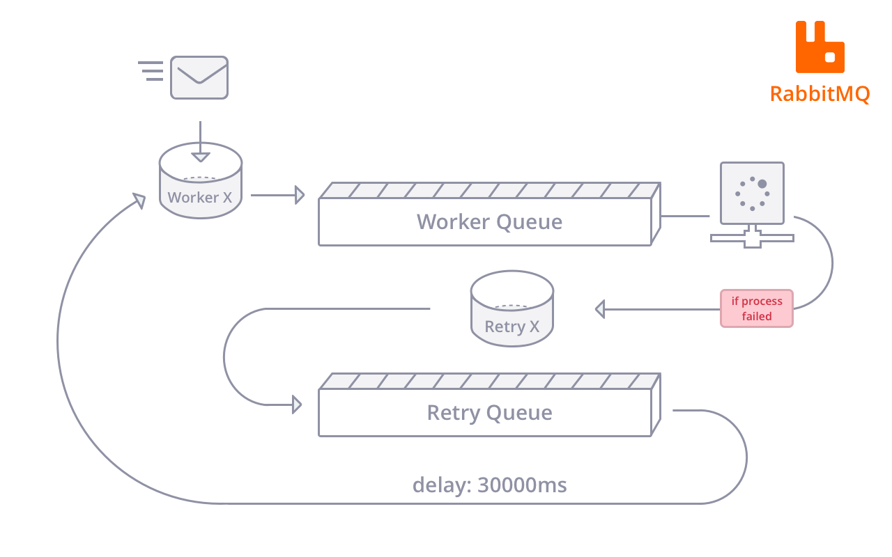

footer: *Vitor Leal* - Campus Party Brasil 2017
build-lists: true
theme: Poster

# Desafios dos *Microserviços*

---

# Vitor Leal

### *CTO na Ingresse*

---

# Onde me encontrar

- *[linkedin.com/in/vitorleal](https://www.linkedin.com/in/vitorleal)*
- *[github.com/vitorleal](https://www.github.com/vitorleal)*
- *twitter [@vitorleal](https://www.twitter.com/vitorleal)*

---

#www.ingresse.com


*Uma empresa de tecnologia
para o mercado de eventos*

---

App Ingresse para os usuários


^ Aplicativo para os usuários encontrarem eventos e comprarem ingressos com features como transferência de ingressos para sua rede.

---

App Backstage para os produtores


^ Aplicativo para o produtor de evento poder acompanha vendas, validar ingressos e acompanhar métricas.

---

# O que são *Microserviços*?

^ Perimeiro vamos falar sobre o que são os Microserviços e suas principais diferenças e pontos fortes comparado com as aplicações Monolíticas.

---


^ Falando em Monolíticas. Quem nunca se pegou reclamando de ter que dar suporte para uma aplicação onde a única responsabilidade é fazer tudo
A dificuldade de manutenção, code review, de deploy ...

---

# Arquitetura Monilítica


---

# Arquitetura de Microserviços


---

# Porque migar para *Microserviços*?

*A separação de responsabilidades em serviços independentes
facilita a manutenção, criação de novas features e
deploys constantes das aplicações.*

---

> Do One Thing and Do It Well
-- [Unix Philosophy](https://en.wikipedia.org/wiki/Unix_philosophy#Do_One_Thing_and_Do_It_Well)

^ A filosofia Unix, criada pelo Ken Thompson (criador do Unix), é um conjunto de boas prátics para o desenvolvimento de software modular

---

> Write programs to work together
-- [Unix Philosophy](https://en.wikipedia.org/wiki/Unix_philosophy)

---


---

# Benefícios

- *Facilidade de deploy*
- *Liberdade para usar outras linguagens*
- *Resiliência e flexibilidade*
- *Facilidade para escalar somente
os serviços necessários*

^ - Deploys de softwares menores são mais simples de lidar
- Poder escolher a melhor linguagem para aquele serviço específico
- Estrutura se torna mais resiliente a alguns erros
- Ao invés de escalar uma maquina inteira do seu monolítico você pode subir somente mais um container do seu serviço que esta com alta demanda

---

# Docker


---

# Docker Swarm

*O Docker Swarm é uma ferramenta nativa do Docker que permite
a criação de clusters permitindo fazer com que diversos hosts
estejam dentro do mesmo pool de recursos.*

---

# Docker Swarm


---

# Docker Swarm

*Escalando serviços com Docker Swarm*

```
docker service scale <SERVICE-ID>=<NUMBER-OF-TASKS>

docker service scale helloworld=5

helloworld scaled to 5
```

---

# Logs

---

# Logs

*Uma arquitetura de Microserviços distribuido
é muito mais difécil de monitorar.*

---

# Logs

*Para entender o que aconteceu, qual fluxo o
cliente entrou, o que aconteceu com ele os
logs em arquivos vão ser o seu maior inimigo.*

---

# Logs - ELK


---

# Logs - Kibana


---

# Go Async

---

# Go Async

*Trabalhar de forma assíncrona vai facilitar a comunicação
entre serviços e vai proporcionar para a sua arquitetura:*

---

# Go Async

- *Fluxo voltado para eventos*
- *Fluxo para retentativas*
- *Modelo Publish/Subscribe (Pub/Sub)*

^ Fluxo voltado para eventos que vai permitir você executar multiplos processos simultâneos e responder praticamente em tempo real para os seus usuários e integrações

---

# Go Async


---

# Go Async - RabbitMq


*RabbitMq é um broker de mensagens
que usa o protocolo AMQP.*

^ AMQP - Advanced Message Queuing Protocol

---

# Go Async - RabbitMq

*O papel do Broker é receber mensagens
dos Publisher e envia para Consumers que
querem o conteúdo dessas mensagens
para processar sob demanda.*

---

# Go Async RabbitMq


---

# Go Asybc - RabbitMQ Retry



---

# API Gateway

---

# API Gateway

*O API Gateway serve como a porta de entrada para os
seus Microserviços resolvendo problemas comuns como:*

---

# API Gateway

- *Autenticação*
- *Limite de uso*
- *CORS (Cross-origin)*

---

# API Gateway

### *Arquitetura sem API Gateway*

*Cada serviço implementa logicas como autenticação, logs e cache que podem gerar inconsistências na utilização das API's*


---

# API Gateway

### *Arquitetura com API Gateway*

*Requisitos como autenticação, logs e cache são resolvidos em uma camada antes de chegar em cada serviço simplificando a utilização das API's*


---


---


[https://getkong.com](https://getkong.com)

---

# FIM

---

# Referências

- *Tutorial ELK Log Stack [https://goo.gl/p667Rw](https://goo.gl/p667Rw)*
- *[https://www.rabbitmq.com/](https://www.rabbitmq.com/)*
- *API Gateway [https://getkong.org](https://getkong.org)*
- *[https://www.docker.com/products/docker-swarm](https://www.docker.com/products/docker-swarm)*
- *[https://www.docker.com/products/docker-swarm#/demo](https://www.docker.com/products/docker-swarm#/demo)*

