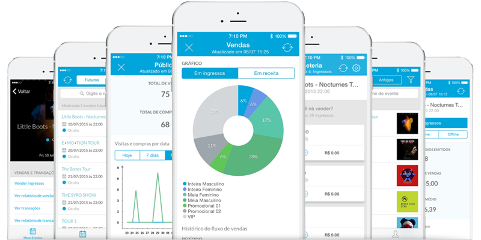
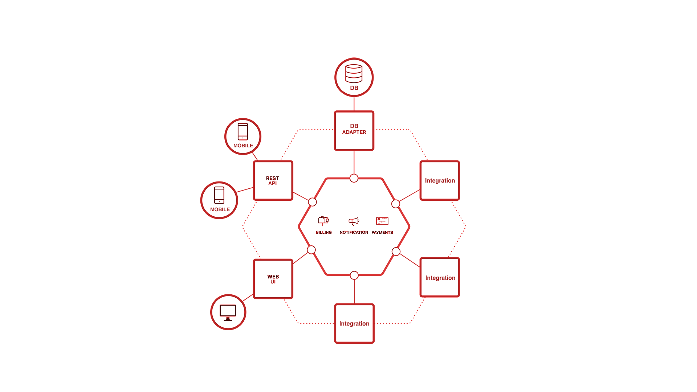
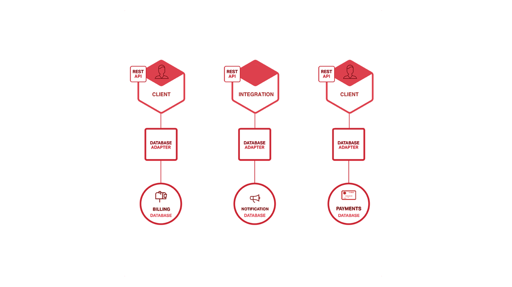
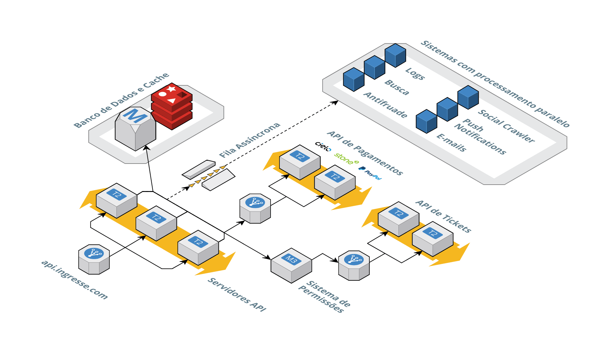
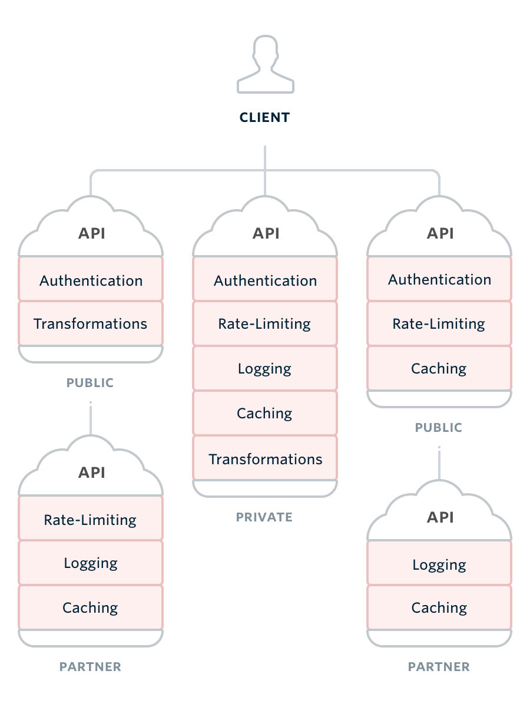
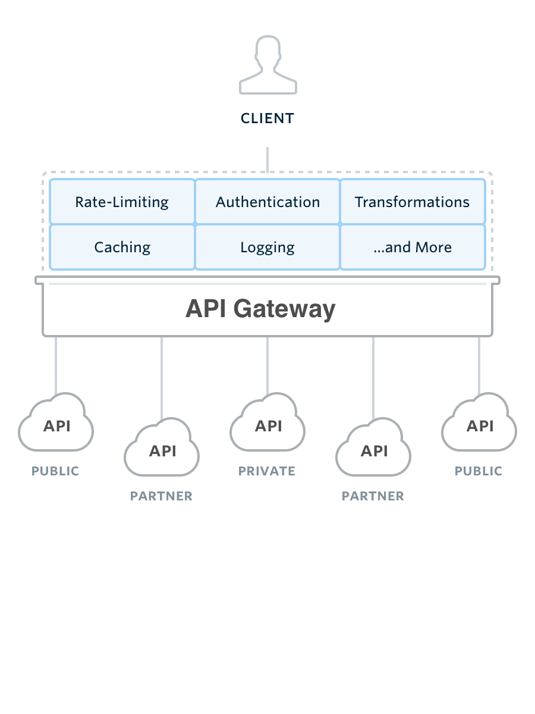

build-lists: true
theme: Poster

# O que são *Microserviços*

---

# Vitor Leal

### *CTO na Ingresse*

---

# Hugo Campos

### *Backend Sênior na Ingresse*

---

*Ingresse é uma empresa de
tecnologia para o mercado de eventos*

---

### *www.ingresse.com*

---

App Ingresse para os usuários

^ Aplicativo para os usuários encontrarem eventos e comprarem ingressos com features como transferência de ingressos.

---

App Backstage para os produtores

^ Aplicativo para o produtor de evento poder acompanha vendas, validar ingressos e ver métricas.

---

# O que são *Microserviços*?

^ Vamos falar sobre o que são os Microserviços, suas principais diferenças e pontos fortes comparado com as aplicações Monolíticas.

---

^ Falando em Monolíticas. Quem nunca se pegou reclamando de ter que dar suporte para uma aplicação onde a única responsabilidade é fazer tudo
A dificuldade de manutenção, code review, de deploy ...

---

# Arquitetura *Monolítica*

---

---

# Arquitetura de *Microserviços*

---

---

# Arquitetura *Ingresse*

---

---

# Mindset

---

# Mindset

- *Estrutura descentralizada*
- *Separar aplicações por times*
- *Facilita a manutenção dos produtos*
- *Resiliência e flexibilidade*

---

> Do One Thing and Do It Well
-- [Unix Philosophy](https://en.wikipedia.org/wiki/Unix_philosophy#Do_One_Thing_and_Do_It_Well)

^ A filosofia Unix, criada pelo Ken Thompson (criador do Unix), é um conjunto de boas prátics para o desenvolvimento de software modular

---

> Write programs to work together
-- [Unix Philosophy](https://en.wikipedia.org/wiki/Unix_philosophy)

---

# Desafios dos *Microserviços*

- *Interação entre microserviços*
- *Autenticação (usuários e aplicações)*
- *Não multiplicar a complexidade*

---

### Arquitetura complexa de Microserviços

*Cada serviço implementa logicas como autenticação, logs e cache que podem gerar inconsistências na utilização das API's*

---

### Arquitetura simplificada de Microserviços

*Requisitos como autenticação, logs e cache são resolvidos em uma camada antes de chegar em cada serviço simplificando a utilização das API's*

---

---

# FIM

---

# Vagas Abertas

- Desenvolvedor Backend
- Desenvolvedor Frontend
- Desenvolvedor Mobile

*https://sobre.ingresse.com/vagas*

*rh@ingresse.com*

